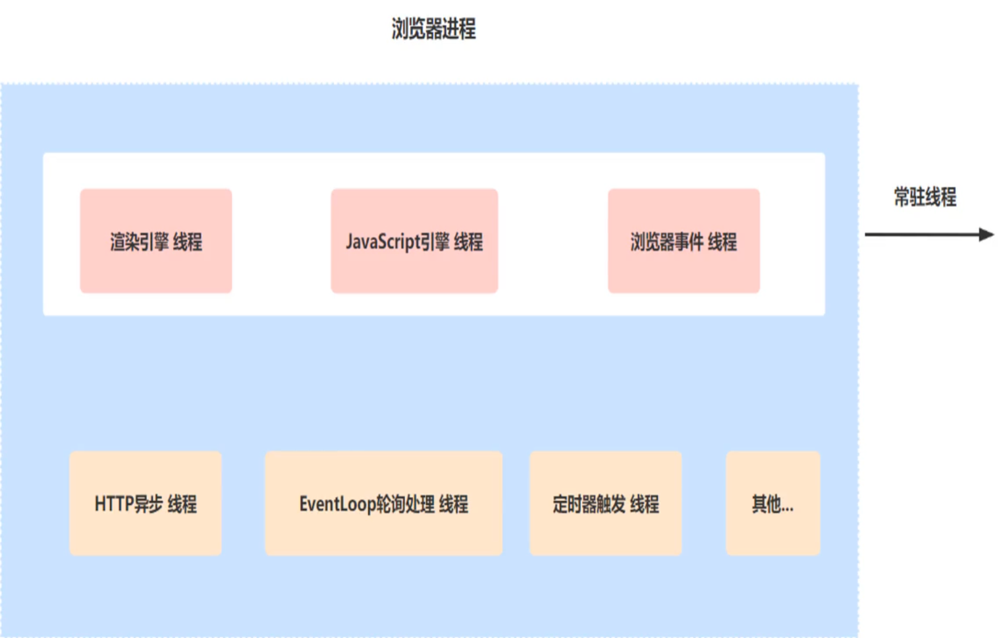
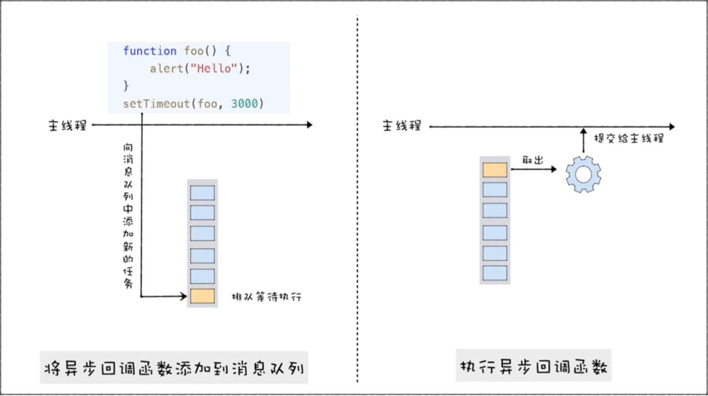

# 异步编程 - 发布订阅

> 浏览器多线程
>
> ​	浏览器有多个线程去辅助JavaScript运行



* 当JavaScript引擎线程（主线程）会去解析执行代码
  * 到遇到异步的代码时：

* ​	异步任务会分发给不同的线程去进行处理然后注册回调到事件队列（event Table发布，evetQueue订阅）
  * 

> **注意：异步编程里会有两个问题**
>
> ​	**1、违法直觉**
>
> ​	**2、回调地狱**

> **异步编程解决方案：**
>
> ​	**1、发布/订阅（发布者发布消息，订阅者订阅消息通知发布者）**
>
> ```javascript
> request("xxx",function(error,response){
> 	pubSub.publish("request1")
> })
> pubSub.subscribe("request1",() => {
> 	pubSub.publish("request2")
> })
> ...
> 
> 与观察者模式不同点：
> 	发布订阅是可以完全解耦的。
>     - 观察者模式会监听数据发生变化后通知被观察者处理（两者进行通信，"被观察者"需要去维护一套"观察者"集合，将有关状态的任何变动自动通知给"观察者"）
> 		- 松耦合
> 		- 例如 "Vue数据侦测观察者"
> 			Vue源码：
>             前提：页面{{message}}（首次渲染读data）
>                 Observer 侦测数据对象的状态变更
>                 Observer会接收value去接受Vue组件里面的Data对象
>                 Observer会调用walk函数，传入这个对象，然后将这个对象的可枚举属性，遍历这个对象中的属性，传入到defineReactiv$$1(data对象，遍历的这个对象当前位的属性名称)
> 			   在调用defineReactiv$$1的时候，会为每一个data对象内的属性创建一个dep实例对象（存放当前这个属性值被哪个组件引用了）当哪一个属性发生变动时，会去读取这个dep实例对象，找到当前值所引用到的组件容器dep，按照dep容器里保存的组件，去通知对应的组件执行渲染函数。不会去触发别的组件执行渲染函数（Vue触发更新保证组件的最小化）
> 			   然后通过defineProperty去侦测对象中属性状态的变更（set方法）通过dep.notify()去通知对应的观察者 
>                
>                	注意：
>                     watcher会去监听页面所依赖的数据，去生成"虚拟DOM"，执行渲染函数(VM.$options.render)也就是观察者
> 				  		这个渲染函数会去做一个作用域绑定，this绑定到当前组件的data数据对象
>                       	  当组件访问data属性时，会调用defineProperty中的get方法（get方法会去做依赖收集，哪些组件触摸了哪些数据，修改过后又来get的时候也是如此）dep.depend()也就是这里去绑定了数据与观察者的关系的，在defineReactiv$$1调用时会去读对应在dep里面绑定的组件去执行该组件的渲染函数。
>                     	
>     - 而发布订阅是由消息中心去处理的（"订阅者"不需要去关心"发布者"的处理逻辑，都是依靠"消息中心"去通信的，也就解耦了）
>     	- 解耦
> ```
>
> ​	**2、deferred对象**
>
> ​	**3、Promise**
>
> ​	**4、Generator**
>
> ​	**5、async / await （最终解决规范,以同步的方式去书写异步代码）**

